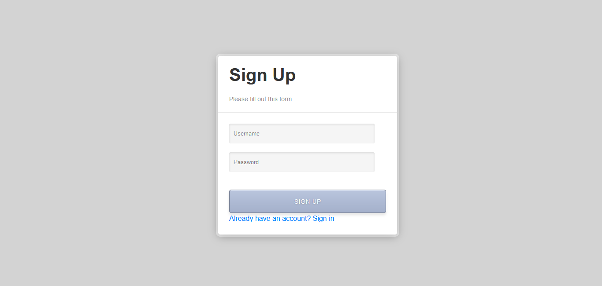
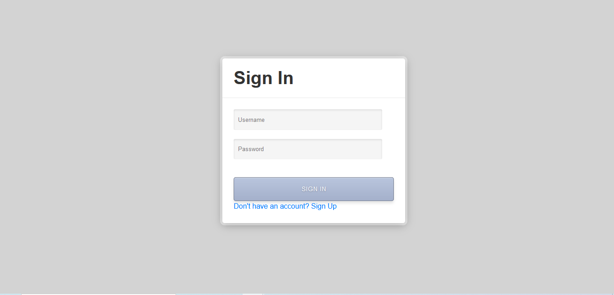
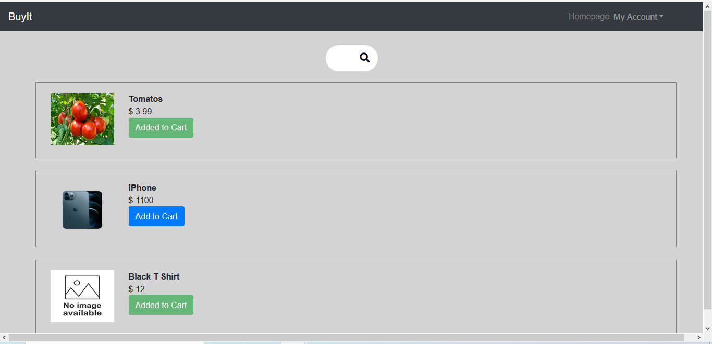
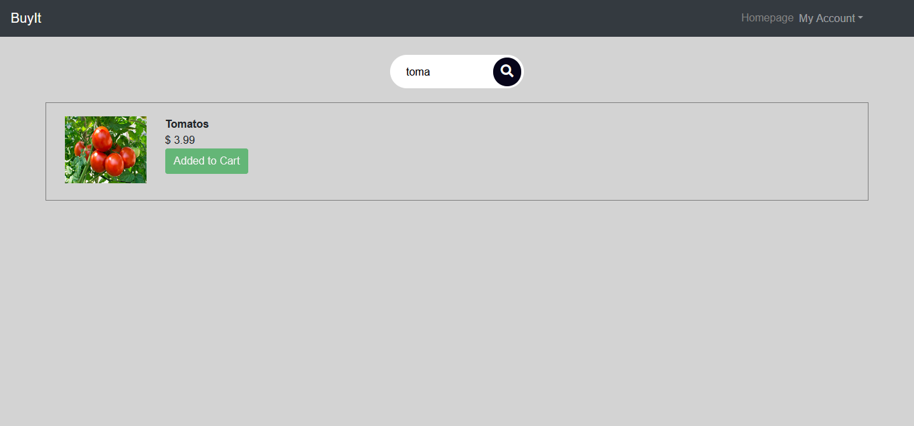
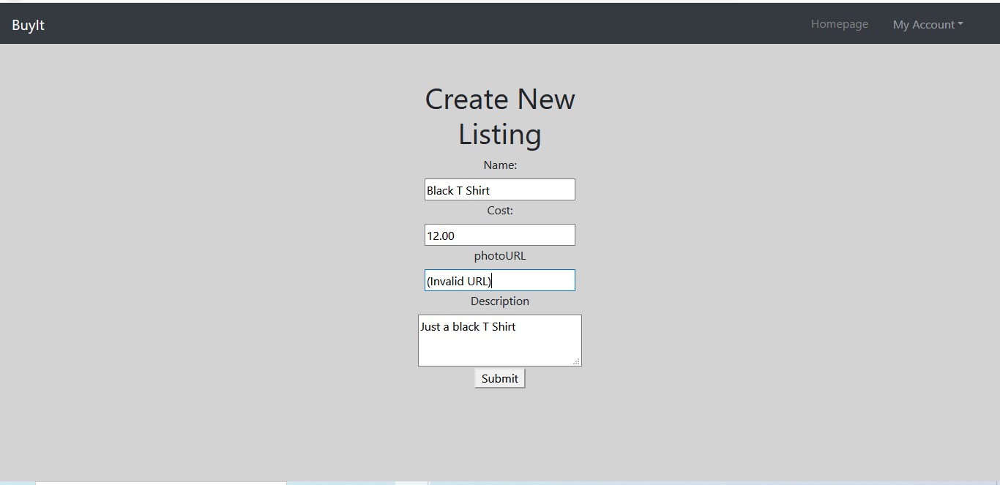
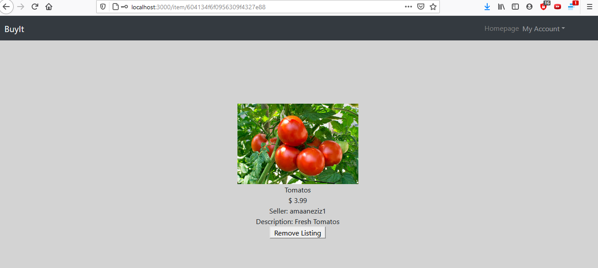
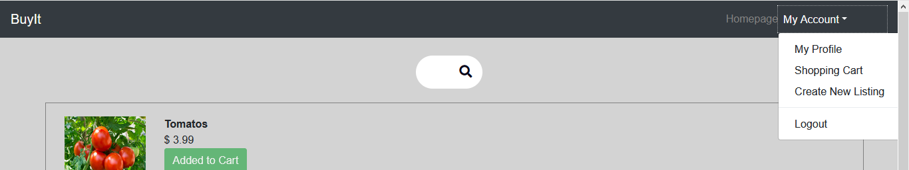
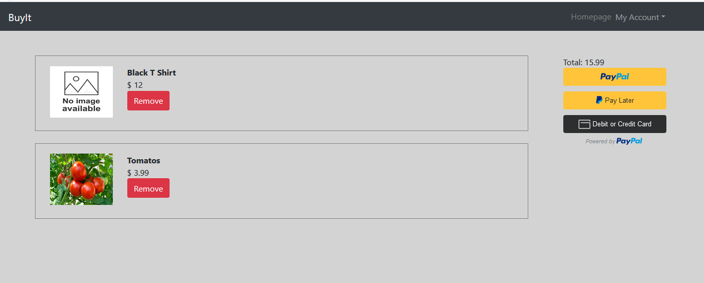
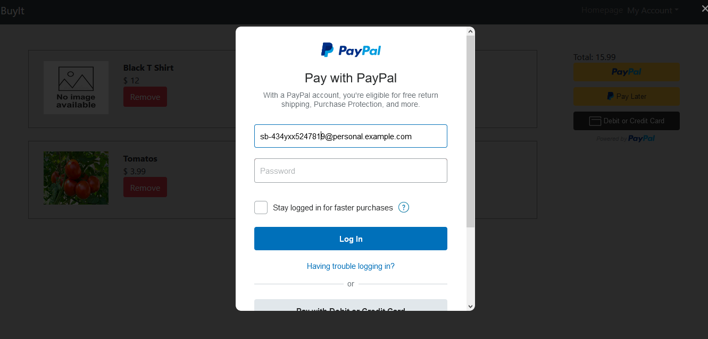

Amaan Eziz

This eCommerce site named "buyIt" allows users to register, sign in, create new listings, add and remove listings from their cart, and purchase listing using the PayPal sandbox payment method. It includes user authentication and user authorization. It uses mongoDB for the database, React/React-Router for the front-end, and expressJS/nodeJS for the back-end. It also uses React-Bootstrap and regular CSS for the styling. 

SignUp:

   
SignIn:

   
Homepage:

   
Search Bar:

   
Create New Listing:

   
Item:

   
NavBar:

   
Shopping Cart:

   
Payment Screen:

   